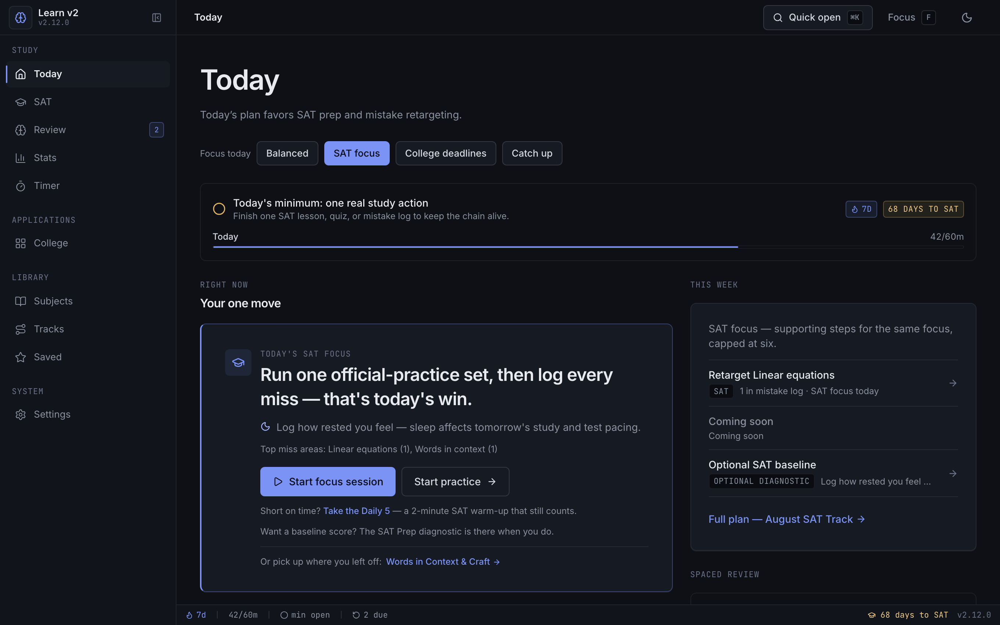
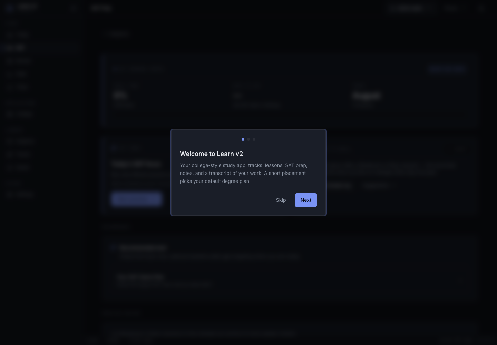
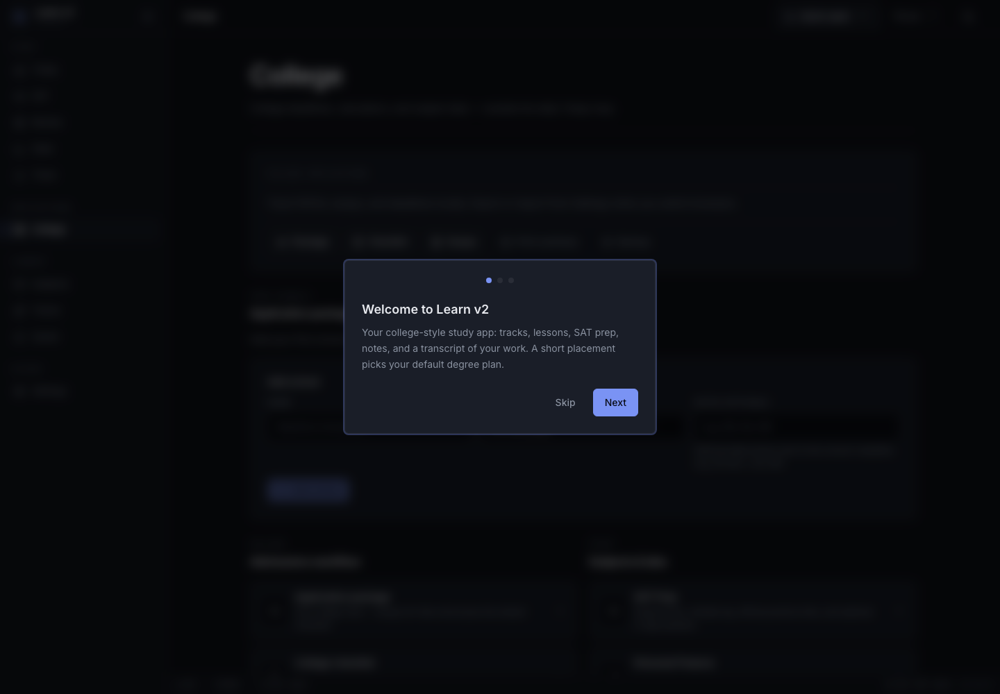
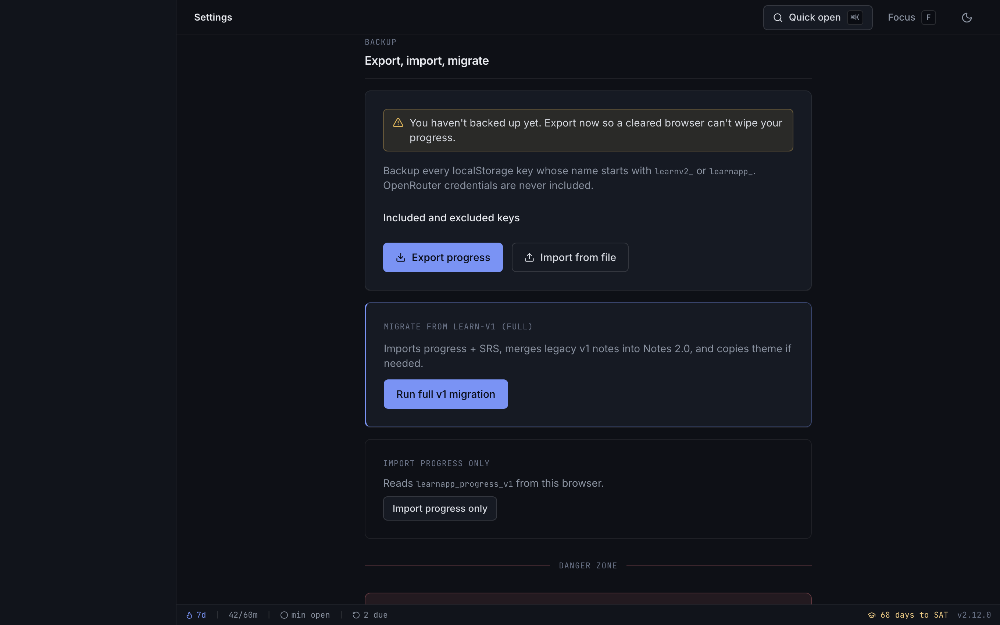

# Learn v2

[](https://github.com/vibezz6/learnv2-public/actions/workflows/ci.yml)
[](LICENSE)


Learn v2 is a local-first study PWA for SAT prep, college application work, spaced review, and personal learning workflows. It runs entirely in the browser with no accounts or backend. Your progress lives in localStorage, and you control backups through JSON export/import.

**Current release:** v2.12.0 ·· **License:** MIT

## Screenshots

| Today | SAT hub |
|-------|---------|
|  |  |

| College hub | Settings and privacy |
|-------------|----------------------|
|  |  |

## Stack

- React 19 + TypeScript + Vite 8
- Tailwind CSS v4 · cool-slate IDE design tokens (indigo accent)
- React Router v7 · shareable lesson URLs
- Zustand + persist · localStorage-first, no accounts
- KaTeX · PWA (manifest + service worker)

## Features

**Core loop**

- **Today** — one coordinated priority, study intent, daily minimum + streak, week plan, college/SAT nudges, spaced review, and daily challenge
- **8 public subjects** — responsive skill-tree navigation with prerequisites, XP, and completion tracking
- **SAT Prep** — study-first hub (lessons, mistake log, drills, official practice), optional Draft 1/2/3 diagnostics, 80-lesson August track, Bluebook checkpoints
- **Lessons** — worked examples, curated resources, takeaways, quizzes with resume/retry, KaTeX math
- **SRS review** — spaced repetition queue with due-date scheduling
- **Tracks** — guided learning paths across subjects
- **Quizzes** — per-lesson recall with in-progress state persisted locally

**Second brain**

- **Office hours (notes)** — session notes → TA feedback → recall check-in; works offline without an API key, richer with OpenRouter in Settings
- **Bookmarks** — save lessons and individual resources
- **Command palette** — `⌘K` / `Ctrl+K` fuzzy search with grouped results and persisted recents

**Focus & polish**

- **Desktop-first study loop** — mobile remains usable, but new polish targets the computer study flow first
- **Deep focus mode** — `F` hides chrome for distraction-free study
- **Study timer** — timed sessions with summary
- **Review & stats** — SRS spotlight cards, level/streak hero, 7-day study chart, achievement unlocks
- **College services** (`/campus`) — college checklist, essay tracker, calculators, SAT, and finance basics
- **College checklist** — FAFSA, counselor, SAT send, custom deadlines (`/campus/college-checklist`)
- **Essay tracker** — Common App / supplement prompts, draft status, due dates (`/campus/essay-tracker`)
- **Placement onboarding** — SAT, foundations, or explore; enrolls default track on first run
- **Admissions nudges** — dashboard reminders for overdue essays and checklist steps
- **Study transcript** (Stats) — copy/download proof of study hours and progress
- **Tools** — compound interest and expected value calculators (`/campus/calculators`)
- **Achievements & sounds** — level-ups, toasts, optional audio
- **Themes** — dark, light, system
- **Export / import** — JSON backup of all `learnv2_*` and `learnapp_*` localStorage keys (OpenRouter API keys excluded)
- **Onboarding** — placement + track enrollment; links to Settings when v1 data is detected

**Migration support**

- Full v1 → v2 migration for progress, SRS, notes, bookmarks, achievements, and theme
- Curriculum split tooling for maintainers

## Curriculum

Current bundled curriculum:

| Metric | Count |
|--------|------:|
| Subjects | 8 |
| Lessons (nodes) | **132** |
| Quiz questions | **441** |
| Worked examples | **163** |
| Threshold flags | **110** (all SAT Prep — drill lessons, no worked examples by design) |

| Subject | Nodes | Quiz Qs | Worked Examples |
|---------|------:|--------:|----------------:|
| sat-prep | 79 | 231 | — |
| math | 23 | 94 | 72 |
| science | 16 | 59 | 48 |
| cs | 5 | 20 | 15 |
| programming | 2 | 11 | 7 |
| probability | 2 | 6 | 6 |
| ai | 1 | 4 | 3 |
| finance | 4 | 16 | 12 |

Maintainer note: `npm run curriculum:split` is available for regenerating curriculum JSON from the legacy source tree when that source is present locally. SAT Prep lives in `src/curriculum/data/sat-prep.json` and is maintained in this repo.

## Run it yourself (no Cursor needed)

You never need Cursor or any AI tool to run Learn v2 — it is a plain Vite + React app.

**Prerequisites:** [Node.js](https://nodejs.org) 20 or newer (Node 22 LTS recommended). Check with `node -v`.

**Start it:**

```bash
git clone https://github.com/vibezz6/learnv2-public.git
cd learnv2-public
npm install      # first time, and after pulling new changes
npm run dev      # then open http://127.0.0.1:8080
```

The port (8080) is fixed in `vite.config.ts` — just open the URL; don't append a port on the command line.

**Production build, run locally:**

```bash
npm run build
npm run preview
```

**Update to the latest version:**

```bash
git pull            # get the newest code
npm install         # pick up any new dependencies
npm run dev
```

Your progress is stored in the browser, not the repo, so pulling/updating never touches it. Export a backup first if you want to be extra safe.

**Install it as an app (optional):** Learn v2 is a PWA. In Chrome/Edge, open the running site and use the install icon in the address bar (or browser menu → "Install Learn v2") to get a standalone window. Once installed it also loads offline. When a new build is deployed you'll see a small "update" banner — click it to refresh. Note: an installed copy uses the same browser storage as the tab it was installed from.

**Troubleshooting:**

- Blank page or "can't connect": nothing is listening on 8080 — make sure `npm run dev` is running in this folder.
- `command not found: npm`: install Node.js (link above), then reopen the terminal.
- Errors after pulling changes: re-run `npm install`.

## Back up your data (so you never lose progress)

Progress lives in your browser's localStorage for the exact origin you use (`http://127.0.0.1:8080` locally, or a different origin — these are separate stores). Clearing browser data, switching browsers, or using a different URL means different or empty data, so keep your own backups:

1. In the app: **Settings → Backup → Export progress** — downloads `learnv2-backup-YYYY-MM-DD.json`.
2. Save that file somewhere safe (a cloud drive). Export weekly, or whenever the app nudges you.
3. To restore on any browser or machine: **Settings → Import from file** and choose the JSON.

Backups include every `learnv2_*` and `learnapp_*` key; OpenRouter API keys are never included.

Backup files may contain study history, notes, SAT mistakes, colleges, essay titles, and application deadlines. Treat them as private and do not attach them to public issues or pull requests.

Ongoing improvements are tracked in [ROADMAP.md](ROADMAP.md). Maintainer batch history lives in [BATCHES.md](BATCHES.md).

## Dev

```bash
npm run build
npm run preview
npm run test
npm run test:watch
npm run lint
npm run doctor          # lint + unit tests + curriculum:lint + sat:coverage:strict + build (run from repo root)
npm run curriculum:split
npm run version:bump
npm run sat:coverage
npm run sat:coverage:strict
npm run test:e2e
```

See [CHANGELOG.md](CHANGELOG.md) for release notes. `npm run version:bump` syncs `package.json`, `src/lib/version.ts`, and the PWA service worker cache name.

See [CONTRIBUTING.md](CONTRIBUTING.md) for contributor setup and pull request expectations.

## Migrate from v1

Use the **same browser** where Learn-v1 stored your progress (localStorage is origin-scoped). Run v2 on the same origin you used for v1 if possible (`http://127.0.0.1:8080`).

1. **Recommended — full migration:** Open v2 → **Settings** → **Run full v1 migration**
   - Imports progress + SRS schedules (normalized on import; invalid SRS dates flagged)
   - Merges legacy v1 notes and lesson takeaways into Notes 2.0
   - Copies resource/lesson bookmarks, achievements, and theme when present (existing v2 theme is preserved)
   - Reloads UI after import so migrated state is visible immediately
2. **On first launch:** onboarding detects v1 data and links to Settings for full migration
3. **Progress only:** Settings → **Import progress only** (reads `learnapp_progress_v1`)
4. **Manual backup:** Export JSON from v1 Settings → Import from file in v2 Settings

After migration, confirm SRS due dates and note sessions look correct before relying on v2 exclusively.
