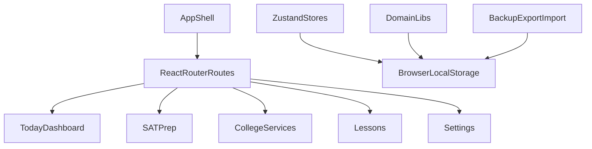

# Architecture

Learn v2 is a client-only React PWA. There is no app backend, database, auth system, or server-side sync.

## Stack

- React 19
- TypeScript
- Vite
- React Router
- Zustand
- Tailwind CSS v4
- KaTeX
- Playwright and Vitest

## App Shape

## Routes

Top-level routing lives in `src/app/App.tsx`.

Navigation constants live in `src/app/navigation.ts`.

Important routes:

- `/` — Today
- `/subjects/sat-prep` — SAT Prep hub
- `/sat/daily-quiz` — SAT Daily 5
- `/sat/drill` — SAT drills
- `/campus` — College services
- `/campus/application` — Application package
- `/campus/college-checklist` — College checklist
- `/campus/essay-tracker` — Essay tracker
- `/settings` — backup, import, local data, optional AI key

## Storage Model

Most persisted state uses browser `localStorage` keys beginning with `learnv2_` or legacy `learnapp_`.

Core Zustand stores:

- `src/stores/progress.ts`
- `src/stores/preferences.ts`
- `src/stores/bookmarks.ts`
- `src/stores/focusSession.ts`

Domain storage modules include SAT pretests, mistakes, activities, colleges, essays, and backup format logic.

The canonical storage registry is `src/lib/storageRegistry.ts`. Backup/import logic is in `src/lib/backupFormat.ts`.

## Safety Patterns

- `src/lib/storageSafety.ts` provides safe Zustand persist storage and failure status.
- `src/lib/storageJson.ts` provides safe JSON reads/writes for domain modules.
- Corrupt critical storage should be quarantined instead of silently overwritten.
- Backup export excludes OpenRouter credentials.

## Today Priority

`src/lib/todayPriority.ts` coordinates Today’s main action across urgent college work, catch-up intent, SAT work, spaced review, and empty states.

This keeps the Today hero, study intent, week plan, and secondary nudges from competing with each other.

## Optional AI

AI review features call OpenRouter directly from the browser when the user provides a key. There is no proxy server. See `docs/PRIVACY.md` and `SECURITY.md`.

## PWA and Deploy

The app deploys as a static SPA. `` rewrites all routes to `index.html`.

The service worker is in `public/sw.js`; version sync is handled by `scripts/bump-version.mjs`.
